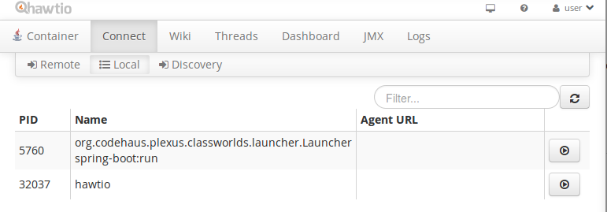
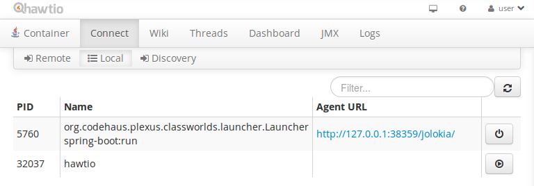

# Logging to Hawtio from Camel Spring-Boot application

## Clone and run this example

Clone from Github
```
git clone git@github.com:jnupponen/camel-spring-boot-hawtio-logging
```

and run with Maven (note Maven 3 and Java 8 required).
```
cd camel-spring-boot-hawtio-logging
mvn spring-boot:run
```


## Download and run Hawtio

Go to Hawtio web site [http://hawt.io/getstarted/](http://hawt.io/getstarted/) and download most recent version of Hawtio executable jar.

Start Hawtio web console by running command

```
java -jar hawtio-app-1.4.65.jar --port 8090
```

Note that we use port **8090** since example application from this repository will use **8080** by default. Also change version **1.4.65** to match the one you downloaded.

## Monitor application
Open [http://localhost:8090/hawtio](http://localhost:8090/hawtio) in you browser.

Navigate to Connect and Local tab and press *"play"* button next to line that says *org.codehaus.plexus.classwordls.launcher.Launcher spring-boot:run*.




Then click *Agent URL* next to the *"play"* button.



And finally navigate to the Logs tab.

 
